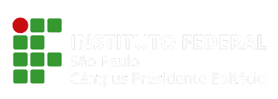

  
  <h1 align="center">Guia do Desenvolvedor Back-end - IFSP</h1>

## :dart: O GUIA

Abaixo você encontrará conteúdos para te guiar e ajudar no back-end.

## 📚 ÍNDICE

[🐧 Linux](#-linux)  
[🐵 Git & Github](#-git-&-github)  
[🐺 HTML](#-html)  
[🐱 CSS](#-css)  
[🦁 JavaScript](#-javascript)  
[🦊 Java](#-java)  
[🦝 C](#-c)  
[🐮 C++](#-c-1)  
[🐷 C#](#-c-2)  
[🐯 PHP](#-php)  
[🐴 Node.js](#-node-js)  
[🐔 MongoDB](#-mongodb)  
[🐲 PostgreeSQL](#-postgreesql)  
[🐒 SQL](#-sql)  
[🦏 MySQL](#-mysql)  
[🐙 Estatística](#-estatística)  
[🦚 Padrões de arquitetura](#-padrões-de-arquitetura)  
[📚 Recomendação de livros](#-recomendação-de-livros)  
[🛠️ Ferramentas & Desafios](#-ferramentas-e-desafios)  

## 🗺️ Back-end roadmap

## ◾ Git & Github

> Git é um sistema de controle de versões distribuído, usado principalmente no desenvolvimento de software, mas pode ser usado para registrar o histórico de edições de qualquer tipo de arquivo.

- [Git - W3Schools](https://www.w3schools.com/git/default.asp) - W3Schools é um site educacional voltado ao aprendizado de tecnologias web. Seu conteúdo inclui tutoriais e referências relacionadas a diversas linguagens.
- [Git4Noobs](https://github.com/DanielHe4rt/git4noobs) - A ideia é ensinar para os usuários iniciantes que o Git não é nenhum "monstro" de se aprender e também ensinar como usar num ambiente onde há mais de um desenvolvedor atuando no projeto sem desorganizar ou perder algum traço de código no processo.
- [Conhecendo os super poderes do Git](https://github.com/theandersonn/comandos-git) - Guia com seleção de comandos para o Trabalho com Git e GitHub
- [Aprenda Git](https://learngitbranching.js.org/?locale=pt_BR) - Aprenda a utilizar o Git e seus comandos através desse site.
- [Git School](https://git-school.github.io/visualizing-git/) - Escola do Git, várias ferramentas para treinar e aprender Git.
- [Git Flow Cheatsheet](https://danielkummer.github.io/git-flow-cheatsheet/) - Este cheatsheet demonstra o uso básico e o efeito das operações do git-flow
- [Cursos de Git & Github](https://github.com/arthurspk/guiadevbrasil#-cursos-de-git-e-github) - Cursos de Git & Github do repositório geral do Guia Dev Brasil

## ◾ HTML

> HTML (Linguagem de Marcação de HiperTexto) é o bloco de construção mais básico da web. Define o significado e a estrutura do conteúdo da web. Outras tecnologias além do HTML geralmente são usadas para descrever a aparência/apresentação (CSS) ou a funcionalidade/comportamento (JavaScript) de uma página da web, sendo assim HTML é uma linguagem essência para você que quer se tornar desenvolvedor front-end.

- [MDN - HTML](https://developer.mozilla.org/pt-BR/docs/Web/HTML) - O MDN Web Docs é o website oficial de Mozilla para desenvolvimento de padrões web
- [Cursos de HTML](https://github.com/arthurspk/guiadevbrasil#-cursos-de-html-e-css) - Cursos de HTML do repositório geral do Guia Dev Brasil

## ◾ CSS

> CSS (Cascading Style Sheets) é um mecanismo para adicionar estilo a um documento web. O código CSS pode ser aplicado diretamente nas tags ou ficar contido dentro das tags <style>. Também é possível, em vez de colocar a formatação dentro do documento, criar um link para um arquivo CSS que contém os estilos.

- [MDN - CSS](https://developer.mozilla.org/pt-BR/docs/Web/CSS) - O MDN Web Docs é o website oficial de Mozilla para desenvolvimento de padrões web
- [Cursos de CSS](https://github.com/arthurspk/guiadevbrasil#-cursos-de-html-e-css) - Cursos de CSS do repositório geral do Guia Dev Brasil

## ◾ JavaScript

> JavaScript é uma linguagem de programação interpretada estruturada, de script em alto nível com tipagem dinâmica fraca e multiparadigma. Juntamente com HTML e CSS, o JavaScript é uma das três principais tecnologias da World Wide Web.

- [MDN - JavaScript](https://developer.mozilla.org/pt-BR/docs/Web/CSS) - O MDN Web Docs é o website oficial de Mozilla para desenvolvimento de padrões web
- [Cursos de JavaScript](https://github.com/arthurspk/guiadevbrasil#-cursos-de-javascript) - Cursos de JavaScript do repositório geral do Guia Dev Brasil

## ◾ Java

> Java é uma linguagem de programação orientada a objetos. O Java permite executar jogos, fazer upload de fotos, bater papo on-line, fazer tours virtuais e usar serviços, como treinamento on-line, transações bancárias on-line e mapas interativos. Se você não tiver o Java, muitas aplicações e websites simplesmente não funcionarão, aprenda Java e programe em uma qualquer plataforma: Uma das grandes vantagens do Java é que ele além de ser uma linguagem é uma plataforma de desenvolvimento. Com ele é possível desenvolver aplicações para desktop, celular, cartão, web, televisão digital, etc.

- [Java - W3Schools](https://www.w3schools.com/java/default.asp) - W3Schools é um site educacional voltado ao aprendizado de tecnologias web. Seu conteúdo inclui tutoriais e referências relacionadas a diversas linguagens.
- [Documentação da linguagem Java](https://docs.oracle.com/javase/8/docs/api/) - A documentação do Java encontra-se em inglês porém você pode usar uma extensão ou o google translater para traduzir
- [Cursos de Java](https://github.com/arthurspk/guiadevbrasil#-cursos-de-java) - Cursos de Java diretamente do repositório geral do Guia Dev Brasil.

## ◾ C

> C é uma linguagem de programação compilada de propósito geral, estruturada, imperativa, procedural, padronizada pela Organização Internacional para Padronização, a linguagem C pode ser facilmente encontrada em grandes jogos do mercado atual, editores de imagem e vídeo, robôs, sistemas de automação, e também muitos sistemas operacionais são programados totalmente ou parcialmente em C, como por exemplo o Windows, o Linux e o Mac OS.

- [C - W3Schools](https://www.w3schools.com/c/index.php) - W3Schools é um site educacional voltado ao aprendizado de tecnologias web. Seu conteúdo inclui tutoriais e referências relacionadas a diversas linguagens.
- [Documentação da linguagem C](https://docs.microsoft.com/pt-br/cpp/c-language/?view=msvc-170) - Documentação oficial da linguagem C em PT-BR
- [Cursos de C](https://github.com/arthurspk/guiadevbrasil#-cursos-de-c-1) - Cursos de C diretamente do repositório geral do Guia Dev Brasil

## ◾ C++

> C++ é uma linguagem de programação compilada multi-paradigma e de uso geral, é usado para o desenvolvimento de sistemas embarcados, bibliotecas gráficas, jogos, sistemas operacionais, entre outros, permitindo desenvolver desde tarefas simples como aplicações na linha de comando ou web, até sistemas complexos de tempo real, muito usadas no mercado financeiro. No ensino acadêmico, ela tem grande aceitação porque abrange as linguagens de alto e baixo nível e é open source.

- [C++ - W3Schools](https://www.w3schools.com/cpp/default.asp) - W3Schools é um site educacional voltado ao aprendizado de tecnologias web. Seu conteúdo inclui tutoriais e referências relacionadas a diversas linguagens.
- [Documentação da linguagem C++](https://docs.microsoft.com/pt-br/cpp/cpp/?view=msvc-170) - Documentação oficial da linguagem C++ em PT-BR
- [Cursos de C++](https://github.com/arthurspk/guiadevbrasil#-cursos-de-c-2) - Cursos de C++ diretamente do repositório geral do Guia Dev Brasil

## ◾ C#

> C# é uma linguagem de programação, multiparadigma, de tipagem forte, desenvolvida pela Microsoft como parte da plataforma .NET. A sua sintaxe orientada a objetos foi baseada no C++ mas inclui muitas influências de outras linguagens de programação, como Object Pascal e, principalmente, Java.

- [Tour pela linguagem C#](https://docs.microsoft.com/pt-br/dotnet/csharp/tour-of-csharp/) - Um pouco mais sobre a linguagem C# e o que ela pode fazer.
- [C# - W3Schools](https://www.w3schools.com/cs/index.php) - W3Schools é um site educacional voltado ao aprendizado de tecnologias web. Seu conteúdo inclui tutoriais e referências relacionadas a diversas linguagens.
- [Documentação da linguagem C#](https://docs.microsoft.com/pt-br/dotnet/csharp/) - Documentação oficial da linguagem C# em PT-BR
- [Cursos de C#](https://github.com/arthurspk/guiadevbrasil#-cursos-de-c) - Cursos de C# diretamente do repositório geral do Guia Dev Brasil

## ◾ PHP

> O PHP (um acrônimo recursivo para PHP: Hypertext Preprocessor ) é uma linguagem de script open source de uso geral, muito utilizada, e especialmente adequada para o desenvolvimento web e que pode ser embutida dentro do HTML.

- [PHP - W3Schools](https://www.w3schools.com/php/default.asp) - W3Schools é um site educacional voltado ao aprendizado de tecnologias web. Seu conteúdo inclui tutoriais e referências relacionadas a diversas linguagens.
- [Documentação da linguagem PHP](https://www.php.net/manual/pt_BR/index.php) - Documentação oficial da linguagem PHP em PT-BR
- [Cursos de PHP](https://github.com/arthurspk/guiadevbrasil#-cursos-de-php) - Cursos de PHP diretamente do repositório geral do Guia Dev Brasil.

## ◾ MongoDB

> MongoDB é um software de banco de dados orientado a documentos livre, de código aberto e multiplataforma, escrito na linguagem C++. Classificado como um programa de banco de dados NoSQL, o MongoDB usa documentos semelhantes a JSON com esquemas.

- [Documentação do MongoDB](https://www.mongodb.com/docs/) - Documentação Oficial do MongoDB em inglês.
- [Cursos de MongoDB](#) - Cursos de MongoDB diretamente do repositório geral do Guia Dev Brasil.

## ◾ SQL

> Structured Query Language, ou Linguagem de Consulta Estruturada ou SQL, é a linguagem de pesquisa declarativa padrão para banco de dados relacional. Muitas das características originais do SQL foram inspiradas na álgebra relacional.

- [SQL - W3Schools](https://www.w3schools.com/sql/default.asp) - W3Schools é um site educacional voltado ao aprendizado de tecnologias web. Seu conteúdo inclui tutoriais e referências relacionadas a diversas linguagens.
- [Documentação do SQL](https://docs.microsoft.com/pt-br/sql/?view=sql-server-ver15) - Documentação Oficial do SQL em inglês
- [Cursos de SQL](#) - Cursos de SQL diretamente do repositório geral do Guia Dev Brasil.

## ◾ MySQL

> O MySQL é um sistema de gerenciamento de banco de dados, que utiliza a linguagem SQL como interface. É atualmente um dos sistemas de gerenciamento de bancos de dados mais populares da Oracle Corporation, com mais de 10 milhões de instalações pelo mundo.

- [MySQL - W3Schools](https://www.w3schools.com/mysql/default.asp) - W3Schools é um site educacional voltado ao aprendizado de tecnologias web. Seu conteúdo inclui tutoriais e referências relacionadas a diversas linguagens.
- [Documentação do MySQL](https://dev.mysql.com/doc/) - Documentação Oficial do MySQL em inglês
- [Cursos de MySQL](#) - Cursos de MySQL diretamente do repositório geral do Guia Dev Brasil.

## ◾ Padrões de arquitetura

> Um padrão de arquitetura é uma solução geral e reutilizável para um problema que ocorre com frequência em arquitetura de software dentro de um determinado contexto. Padrões de arquitetura são similares aos padrões de projeto de software, mas possuem um escopo mais amplo

- [Refactoring Guru](https://refactoring.guru/pt-br/design-patterns) - Padrões de projetos "Design patterns"
- [Quais são os tipos de arquitetura de software e como escolher o melhor para seu projeto](https://posdigital.pucpr.br/blog/tipos-de-arquitetura-de-software) - Melhores tipos de arquitetura de software.

## ◾ Recomendação de livros

- [Clean Code - Código Limpo](https://g.co/kgs/62wx9t)
- [Refactoring - Refatoração](https://g.co/kgs/Hf2eY3)
- [Clean Archtecture - Arquitertura Limpa](https://g.co/kgs/Hf2eY3)
- [O programador pragmático](https://g.co/kgs/5nbqB3)

# ◾ Ferramentas e Desafios

> Sites para treinar projetos back-end

- [Dev Challenge Back-End](https://devchallenge.vercel.app/challenges?type=backend) - Treine suas habilidades com desafios Back-end
- [HackerRank](https://www.hackerrank.com/) - Desafios de Programação Back-end. IDE integrada
- [CoderByte](https://coderbyte.com/) - Desafios de Programação Back-end. IDE integrada
- [CodeWars](https://www.codewars.com/) - Desafios de Programação Back-end. IDE integrada
- [Coding Games](https://www.codingame.com/start) - Desafios Programação Back-end com foco em temática de jogos. IDE integrada
- [Edabit](https://edabit.com/) - Desafios de Programação Back-end. IDE integrada
- [ChallengeRocket](https://challengerocket.com/) - Desafios de Programação Back-end. IDE integrada
- [CodeForces](https://codeforces.com/) - Desafios de Programação Back-end com a compilação e testes feito pela plataforma porém sem IDE integrada
- [CodeSignal](https://app.codesignal.com/login) - Desafios de Programação Back-end. IDE integrada
- [Codility](https://www.codility.com/) - Desafios de Programação Back-end. IDE integrada
- [CSES](https://cses.fi/problemset/) - Desafios de Programação Back-end. IDE integrada
- [DailyCodingProblem](https://www.dailycodingproblem.com/) - Desafios de Programação Back-end enviados por e-mail. Solução do problema Premium
- [Exercism.io](https://exercism.org/) - Desafios de Programação Back-end. Sem IDE integrada. Requer download de CLI.
- [LeetCode](https://leetcode.com/) - Desafios de Programação Back-end. IDE integrada
- [BinarySearch](https://binarysearch.com/) - Desafios de Programação Back-end. IDE integrada
- [CodeAbbey](https://www.codeabbey.com/) - Desafios de Programação Back-end. IDE integrada
- [ProjectEuler](https://projecteuler.net/) - Desafios de Programação Back-end focado em problemas matemáticos. IDE integrada
- [Sphere Onlune Judge (SPOJ)](https://www.spoj.com/) - Desafios de Programação Back-end com a compilação e testes feito pela plataforma porém sem IDE integrada
- [TopCoder](https://www.topcoder.com/) - Desafios e Arena de Programação Back-end. IDE integrada
- [URI/Beecrowd](https://www.beecrowd.com.br/judge/en/login) - Desafios Programação Back-end, matemáticos e SQL. IDE integrada
